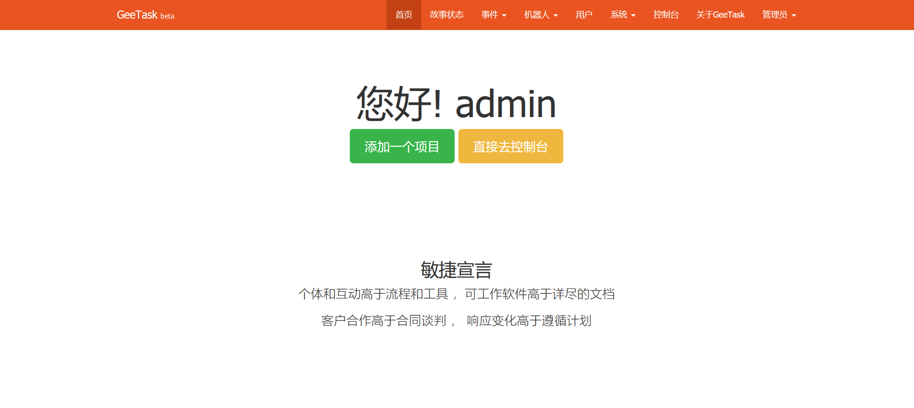
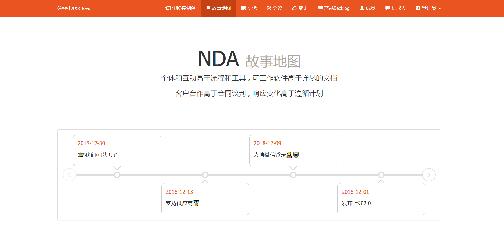
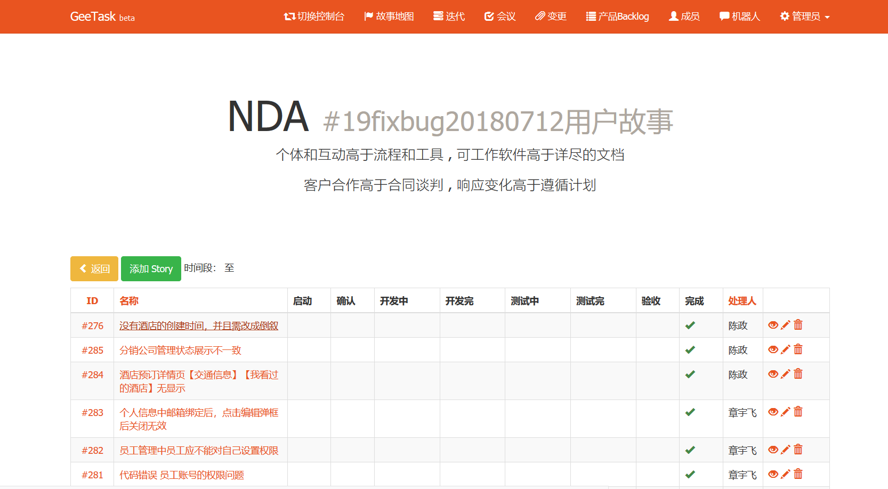

GeeTask
-

一个极简的敏捷项目管理系统。

一个PMP和ACP的结合的产物，以敏捷为核心却有那么一丁点的传统。

只适合小团队，而且负责人可能身兼数职。


GeeTask不是完整的敏捷思想的实现，主要是根据自己的工作环境做了妥协。
我现在的团队是只有4个人团队包括我自己，如果完全按照敏捷过程的实施就会很繁琐，
特别是在关键角色上不能分离，比如PO和PM都是同一个人。
另外，公司的项目的压力以及人员的水平和思想还很难完全按照敏捷的思想去做。像自愿领取任务等这样的工作就很难。

妥协是为了简化
--
- 系统使用必须简单，没有繁琐的各种设置。在项目中分别使用过redmine,禅道，在小团队中很难推，因为添加一个任务或者修改一个任务要设置很多不明觉厉的各种参数，晕！
- 增加了会议记录的功能。会议很重要，我们的需要沟通，我们会花跟多的时间沟通，沟通到每个人都理解对方的需求，甚至写代码的逻辑都会确定清楚。
- 增加了变更记录的功能。系统发布的时候，需要清楚，生产环境会有哪些变更，比如SQL等
- 增加了IM机器人的功能。这个功能是增值功能，目的是让团队时刻收到任务变更的通知，在通知中会指名道姓（表扬）。从心理学上来说，每个人都希望看到自己的名字在一些场合出现会。这种暗示会提高积极性。

系统特点
--
- 基于Yii2框架
- 使用了Yii的RBAC权限框架，在使用的过程中限制了原生的灵活（放弃了可以给某个人分配具体的权限，以及分配多角色多权限），只个一个用户安排一个角色。个人认为这样的系统没有必要把权限分配弄的过于复杂。本身Yii的`RBAC`权限对一般的初学者还有点难度，而且也很难图形化表达角色权限规则等等的关系。本人前端技术有限，之前在其他的项目尝试过，尽管表达了，但是还是很难简化。如果有兴趣可以留言。
- 本系统尽量保证了`RBAC`的功能，比如规则的扩展，系统自实现了项目更新规则（更新自己创建的项目），其他地方暂时没有（只是觉得这样的需求不强烈）。有兴趣的可以自己研究。
- 在Yii的事件中增加了自定义的`简单事件模型`（不是对原生事件的扩展，只是可以通过原生的事件触发），通过后台管理，灵活扩展
- 消息机器人，默认实现了`钉钉机器`。只是在添加或修改故事的时候触发消息。基于自定义事件实现，抽象出各种事件处理句柄。通过后台管理，灵活扩展自己需要的机器人。支持自定义`消息模板`
- 项目管理独立化，用户时刻只能在一个项目的会话下工作，通过切换控制台的功能在用户参与的多个项目中切换工作环境。
- 支持故事状态自定义。本系统默认定义的状态的出发点是类似敏捷的`完成定义`
- 产品Backlog
- 会议记录
- 变更记录
- 增加了emoji表情，让工作的表达也有充满表情

我是如何使用的
--
- 项目应该化80%的时间理解需求确定需求，所有开会讨论是必要的。
- 核心是`计划（迭代）`，负责人必须积极主动的推动团队的积极参与，一定要保持每个人都能参与到，建议每日`站立会议`，形成开会讨论的习惯，引导团队逐步导向团队自治
- 项目的`主持者`是推动的主要动力，也是主要的使用者。负责主持会议，协调和分配任务，主持所有的会议并将结果更新到系统中，也人员可以轮岗记录会议。
- 我们项目约定的迭代周期是1周，一般周5安排下周的开发任务，尽量保证一周完成。
- 如果本周没完成的，大家一起开会讨论，分析原因，是否安排到下周或者放到`产品backlog`中

项目状态
--
系统已经满足我们的项目的基础需求

更多细节已经锦上添花的功能以后有空再开发...

下面是敏捷项目的精髓
--


**敏捷宣言**


个体和互动高于流程和工具 ，可工作软件高于详尽的文档

客户合作高于合同谈判 ， 响应变化高于遵循计划


**敏捷12原则**


**交付价值** 我们最优先考虑的是尽早和持续不断地交付有价值的软件，从而使客户满意

**拥抱变化** 即使在开发后期也欢迎需求变更。敏捷过程利用变更可以为客户创造竞争优势

**持续交付** 采用较短的项目周期（从几周到几个月），不断地交付可工作软件

**合作** 业务人员和开发人员必须在整个项目期间每天一起工作

**人本思想** 围绕富有进取心的个体而创建项目。提供他们所需的环境和支持，信任他们所展开的工作

**面对面沟通** 不论团队内外，传递信息效果最好且效率最高的方式是面对面交谈

**价值** 可工作软件是度量进度的首要指标

**节奏** 敏捷过程倡导可持续开发。发起人、开发人员和用户要能够长期维持稳定的开发步伐

**精益** 坚持不懈地追求技术卓越和良好的设计，从而增强敏捷能力

**简洁** 以简洁为本，最大限度地减少工作量

**自组织** 最好的架构、需求和设计出自自组织团队

**自省** 团队定期反思如何能提高成效，并相应地调整自身的行为

安装系统
--

```
cd web服务器的doc目录，这里是什么就不再多讲。
git clone https://github.com/dungang/gee-task.git
cd gee-task
composer install
```
创建数据库 geetask , 编码一定是 utf8mb4格式

如果是直接生产，请导入数据脚本db.sql

如果需要查看演示，请导入 geetask.sql

默认管理员及密码:admin，admin

效果图
--

- 管理后台


- 项目控制台


- 一次迭代中的故事或任务


其他
--

本系统也可以做学习Yii2框架的实例


